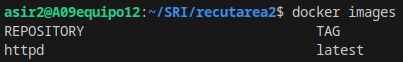
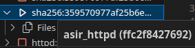
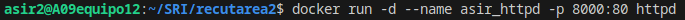
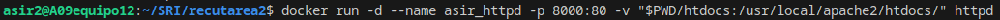

## 1.Descarga la imagen 'httpd' y comprueba que está en tu equipo.

Descargamos la imagen con el comando:

    docker pull httpd

Comprobamos que está en el equipo con el comando:

    docker images

## 2.Crea un contenedor con el nombre 'asir_httpd'

El contenedor se crea con:

      docker run -d --name asir_httpd httpd

## 3.Mapea el puerto 80 del contenedor con el puerto 8000 de tu máquina.

Utilizamos el comando:

       docker run -d --name asir_httpd -p 8000:80 httpd

## 4.Utiliza bind mount para que el directorio del apache2 'htdocs' este montado un directorio que tu elijas.

Utilizamos el siguiente comando:

       docker run -d --name asir_httpd -p 8000:80 -v "$PWD/htdocs:/usr/local/apache2/htdocs/" httpd

